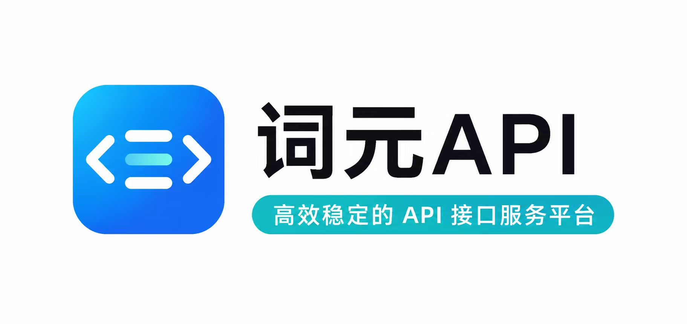

# WeSight

<p align="center">
  
</p>

<h3 align="center">
  本机 AI Agent 桌面工作台
</h3>

<p align="center">
  <a href="https://github.com/freestylefly/wesight/stargazers"></a>
  <a href="https://github.com/freestylefly/wesight/network/members"></a>
  <a href="https://github.com/freestylefly/wesight/releases/latest"></a>
  <a href="LICENSE"></a>
  
</p>

<p align="center">
  <a href="README.md">English</a> | <strong>简体中文</strong>
</p>

WeSight 是一个开源桌面 AI Agent 控制台。它可以安装或复用 Claude Code、Codex、OpenClaw、Hermes Agent、OpenCode、Qwen Code、DeepSeek-TUI 和内置 Agent runtime，把它们统一到一个可视化工作台里，覆盖对话、工具、文件、IM 通道、技能、模型供应商、运行监控和桌面宠物工作流。

> 早期公开版本优先提供 macOS Apple Silicon 安装包。如果 WeSight 对你的 Agent 工作流有帮助，欢迎点亮 Star，让更多开发者看到这个项目。

## 快速入口

- 官网：[wesight.ai](https://wesight.ai/)
- 最新版本：[github.com/freestylefly/wesight/releases/latest](https://github.com/freestylefly/wesight/releases/latest)
- 产品截图：[产品截图](#产品截图)
- 核心功能：[核心功能](#核心功能)
- Agent 引擎：[Agent 引擎](#agent-引擎)
- 本地开发：[快速开始](#快速开始)

## 为什么选择 WeSight

终端原生编码 Agent 很强，但安装、模型路由、权限、IM 入口、文件变更和运行指标经常散落在不同位置。WeSight 把这些环节收进一个桌面工作台：

- 用新手友好的界面安装、检测和复用本机 Agent CLI。
- 通过可视化 Chat 使用编码 Agent，直接查看工具面板、Slash 指令、文件 diff 和权限事件。
- 将 Agent 任务接入飞书等 IM 通道，并按引擎隔离机器人配置。
- 记录每次任务调用的引擎、模型、Token、TTFT、TPS、工具耗时、步骤、状态和总耗时。
- 通过 SkillHub 技能、内置技能、定时任务、记忆系统和桌面宠物扩展日常工作流。

## 产品截图

<table>
  <tr>
    <td width="50%">
      
    </td>
    <td width="50%">
      
    </td>
  </tr>
  <tr>
    <td><strong>Cowork 对话</strong><br>把本机编码 Agent 变成桌面 Chat，支持引擎和模型切换。</td>
    <td><strong>Agent 引擎</strong><br>配置 Claude Code、Codex、OpenClaw、Hermes Agent、OpenCode、Qwen Code、DeepSeek-TUI 和内置 runtime。</td>
  </tr>
  <tr>
    <td width="50%">
      
    </td>
    <td width="50%">
      
    </td>
  </tr>
  <tr>
    <td><strong>AI Runtime Dashboard</strong><br>查看引擎、模型、Token、TTFT、输出阶段 TPS、估算 Model TPS、成本和状态。</td>
    <td><strong>实时工作区</strong><br>在 Agent 工作过程中查看文件写入、代码变更、工具活动和产出文件。</td>
  </tr>
  <tr>
    <td width="50%">
      
    </td>
    <td width="50%">
      
    </td>
  </tr>
  <tr>
    <td><strong>技能市场</strong><br>按 SkillHub 分类浏览技能，下载安装到本机 WeSight 技能目录。</td>
    <td><strong>工作室与宠物</strong><br>用像素工作室和桌面宠物跟随当前任务状态。</td>
  </tr>
</table>

## 核心功能

- **Agent 引擎**：统一运行 Claude Code、Codex、OpenClaw、Hermes Agent、OpenCode、Qwen Code、DeepSeek-TUI 和内置 runtime。
- **一键准备环境**：macOS 下可自动安装支持的本机 CLI，也可以检测已经存在的本机安装。
- **统一模型供应商**：配置官方 OpenAI、Anthropic Claude、Google Gemini、DeepSeek、Qwen、Moonshot、Ollama、OpenRouter、GitHub Copilot 和自定义 OpenAI-compatible 接口。
- **本机 CLI 配置复用**：如果 Claude Code、Codex、OpenClaw、Hermes Agent、OpenCode、Qwen Code 或 DeepSeek-TUI 已经在终端中可用，可以继续使用原有账号和配置。
- **图形化工具执行**：在 Chat 中查看命令、文件、权限、Slash 指令、输出、生成图片和工具结果。
- **IM Agent Hub**：把飞书消息接入 OpenClaw、Hermes Agent、Claude Code 或 Codex，并支持按引擎配置机器人。
- **AI Runtime Dashboard**：按引擎、模型、来源、状态、Token、总耗时、TTFT、输出阶段 TPS、估算 Model TPS、工具耗时和 Agent 步数统计调用。
- **实时工作区**：右侧工作区支持实时写入、静态 diff、运行监控、任务待办、技能和产物展示。
- **SkillHub 技能市场**：发现、分类、安装、启用、禁用、更新和删除本机 WeSight 技能。
- **定时任务**：创建研究报告、监控、邮箱整理、提醒和自动化任务。
- **记忆和个性化**：从对话中提取偏好和长期信息，跨会话延续上下文。
- **桌面宠物和工作室**：用轻量桌面宠物和像素风工作室跟随活跃任务。

## ❤️ 赞助商

> [想出现在这里？](public/readme/community/wechat-personal.jpg) 添加微信时请备注你的产品名和项目赞助说明。

| 赞助商 | 介绍 |
| ------ | ---- |
| <a href="https://pptoken.cc/"></a> | 项目赞助。PPToken 提供 ChatGPT、Claude、Gemini 等主流 AI 模型 API 中转与密钥分发服务，支持低延迟、高可用、按量计费与订阅套餐灵活选择。 |
| <a href="https://ciyuan.today/"></a> | 项目赞助。词元 API 致力于成为开发者的一站式 AI 接口平台，提供稳定、低延迟、高可用的大模型 API 服务，让 AI 应用开发更简单。 |

## Agent 引擎

| 引擎         | 适合场景                                        | 准备方式                                     |
| ------------ | ----------------------------------------------- | -------------------------------------------- |
| 内置 runtime | 通用桌面 Cowork 会话和技能执行                  | WeSight 内置                                 |
| Claude Code  | Claude Code 编码工作流的图形化使用              | 一键安装或复用本机 CLI 配置                  |
| Codex        | Codex CLI 工作流、本机任务执行和 IM 控制        | 一键安装或复用本机 CLI 配置                  |
| OpenClaw     | Runtime gateway、IM 通道、沙箱式 Agent 工作     | 复用本机 runtime/CLI 或使用 WeSight 准备流程 |
| Hermes Agent | 本机 Hermes Agent gateway 和 IM 类 runtime 实验 | 官方 installer 或复用本机 CLI 配置           |
| OpenCode     | OpenCode 终端 Agent 工作流                      | 一键安装或复用本机 CLI 配置                  |
| Qwen Code    | 通义千问友好的编码工作流和 DashScope 配置       | 一键安装或复用本机 CLI 配置                  |
| DeepSeek-TUI | DeepSeek-TUI HTTP/SSE runtime 和工具流式渲染    | 一键安装或复用本机 CLI 配置                  |

## 模型供应商

WeSight 把模型配置集中在一个设置页。某个引擎选择“跟随 WeSight 模型设置”时，WeSight 会把模型配置映射到该引擎。

- 添加多个供应商和多个模型。
- 使用官方 OpenAI、Anthropic Claude 和 Google Gemini 供应商。
- 为 DeepSeek、Qwen、Moonshot、Ollama、OpenRouter、GitHub Copilot、本地网关或私有 endpoint 添加 OpenAI-compatible 配置。
- 在 WeSight 托管模型配置和本机 CLI 配置之间切换。
- 在需要统一管理时导入或同步本机引擎配置。

## 下载

公开桌面安装包通过 GitHub Releases 发布：

- 官网：[wesight.ai](https://wesight.ai/)
- 最新版本：[github.com/freestylefly/wesight/releases/latest](https://github.com/freestylefly/wesight/releases/latest)

早期公开版本优先提供 macOS Apple Silicon 安装包。Release assets 面向最终用户下载。CI artifacts 作为维护者测试构建产物的临时入口。

## 下载与安装教程

### 1. 下载 DMG 并安装

从 [最新版本](https://github.com/freestylefly/wesight/releases/latest) 下载 `WeSight-*-arm64.dmg`，打开后将 `WeSight.app` 拖入 `Applications` 文件夹。

<p align="center">
  
</p>

### 2. 如果 macOS 提示应用已损坏

当前预览版还没有完成 Apple 开发者签名和公证，macOS 可能会显示：

> “WeSight.app” 已损坏，无法打开。你应该将它移到废纸篓。

这通常是 macOS Gatekeeper 对未签名应用添加的隔离提示，不代表安装包真的损坏。请先点击“取消”，不要移到废纸篓。

<p align="center">
  
</p>

### 3. 解除隔离属性并重新打开

打开 macOS 自带的“终端”，输入下面的命令：

```bash
xattr -cr /Applications/WeSight.app
```

<p align="center">
  
</p>

命令执行完成后，重新打开 WeSight 即可。如果你没有把 WeSight 放到 `Applications` 文件夹，请把命令里的路径换成实际的 `WeSight.app` 路径。

## 快速开始

### 环境要求

- Node.js `>=24 <25`
- npm

### 本地开发

```bash
git clone https://github.com/freestylefly/wesight.git
cd wesight
npm install
npm run electron:dev
```

开发服务器默认运行在 `http://localhost:5175`。

### 带 Agent runtime 启动

```bash
# 启动 WeSight，并在设置中检测支持的本机 Agent CLI
npm run electron:dev

# 当前便捷 alias 指向相同开发入口
npm run electron:dev:openclaw
npm run electron:dev:hermes
```

常用 OpenClaw 开发变量：

```bash
# 指定 OpenClaw 源码路径
OPENCLAW_SRC=/path/to/openclaw npm run electron:dev:openclaw

# 强制重建 OpenClaw runtime
OPENCLAW_FORCE_BUILD=1 npm run electron:dev:openclaw

# 本地开发 OpenClaw 时跳过版本切换
OPENCLAW_SKIP_ENSURE=1 npm run electron:dev:openclaw
```

## 构建

```bash
# TypeScript + Vite
npm run build

# Electron main process
npm run compile:electron

# ESLint
npm run lint
```

## 打包

```bash
# macOS
npm run dist:mac
npm run dist:mac:x64
npm run dist:mac:arm64
npm run dist:mac:universal

# Windows
npm run dist:win

# Linux
npm run dist:linux
```

托管 runtime 元信息在 `package.json` 中声明。生成的 runtime 目录、构建产物、本地密钥和打包输出已加入 Git 忽略。

## 架构概览

WeSight 使用 Electron 进程隔离架构。Renderer 不直接访问 Node.js 能力，高权限操作通过 preload bridge 和 main process IPC 完成。

<p align="center">
  
</p>

### Main Process

- 窗口生命周期、托盘、桌面宠物窗口和 deep link
- SQLite 本地持久化，包括设置、会话、消息、runtime calls、技能和登录 token
- Agent 引擎路由和外部 CLI adapter
- OpenClaw 与 Hermes gateway 生命周期辅助
- IM gateway 集成和原生飞书路由
- 技能管理、定时任务、文件活动监听和运行 telemetry

### Renderer

- React + Redux Toolkit + Tailwind CSS
- Cowork Chat UI、工作室、实时工作区、运行监控和 artifacts
- 引擎选择、模型选择、设置、技能、MCP、Agent、IM、记忆和外观界面
- 消息、工具调用、命令输出、Slash 指令面板、文件、图片和权限事件的流式渲染

### 关键目录

```text
src/main/
  main.ts                         Electron 入口和 IPC handlers
  preload.ts                      安全桥接
  sqliteStore.ts                  本地持久化
  coworkStore.ts                  会话和消息存储
  libs/agentEngine/               引擎 adapter 和 router
  libs/externalAgent*.ts          外部 CLI 安装与配置辅助
  im/                             IM gateway 集成

src/renderer/
  App.tsx                         应用外壳
  components/cowork/              Chat、工作室、运行工作区、引擎 UI
  components/Settings.tsx         模型、引擎、IM、技能、记忆和应用设置
  components/pet/                 桌面宠物 UI
  services/                       IPC wrapper 和应用服务
  store/slices/                   Redux 状态

SKILLs/                           内置技能
scripts/                          runtime、打包和安装脚本
src/shared/                       共享常量和类型
```

## 内置技能

WeSight 内置了一组覆盖日常 Agent 工作的技能，并接入 SkillHub 用于技能市场安装。

| 方向       | 示例                                                   |
| ---------- | ------------------------------------------------------ |
| 研究       | Web 搜索、科技新闻、股票研究、影视/音乐搜索            |
| 文档       | DOCX、XLSX、PPTX、PDF 处理                             |
| 自动化     | Playwright、本地工具、定时任务                         |
| 创作       | Remotion 视频、前端设计、Canvas 设计、图片与视频工作流 |
| 通信       | IMAP/SMTP 邮件和 IM 通道                               |
| Agent 构建 | Skill 创建、Skill 审查、自定义规划                     |

技能可以在桌面 UI 中安装、启用、停用、删除和路由。

## 安全设计

- Renderer 开启 context isolation。
- Renderer 禁用 Node integration。
- 敏感操作统一经过 main process IPC。
- 工具执行过程可展示权限确认事件。
- 本地数据存储在应用数据目录中的 SQLite。
- runtime、构建产物、生成资产和本地密钥文件已加入 Git 忽略。

## Roadmap Ideas

- 更多 Agent 引擎 adapter 和 runtime profile
- 更完善的本机配置导入和 provider 同步流程
- 更丰富的 IM Agent profile 和消息形式
- 可分享的任务模板
- 长任务可视化检查工具
- 技能市场更新、评价和版本管理

## 交流群

欢迎扫描下方二维码加入 WeSight 微信交流群，和其他使用者、开发者一起交流。二维码有效期至 2026 年 6 月 8 日；如果过期，可以通过下方公众号获取最新入群方式。

<p align="center">
  
</p>

## Star 趋势图

[](https://star-history.com/#freestylefly/wesight&Date)

## 公众号

微信搜索 **苍何** 或扫描下方二维码关注苍何的原创公众号，回复 **AI** 获取更多 AI 提示词与 Agent 工作流资料。

<p align="center">
  
</p>

## 致谢

WeSight 的设计与工程实现受到了许多优秀开源项目和 Agent 社区实践的启发，特别感谢：

- [LobsterAI](https://github.com/netease-youdao/LobsterAI)：桌面端个人助理 Agent 产品形态、README 组织和开源发布实践带来的启发。
- [OpenClaw](https://github.com/openclaw/openclaw)：本机 Agent runtime、网关和 IM Agent 能力的探索。
- [Hermes Agent](https://github.com/NousResearch/hermes-agent)：本机 Agent runtime、gateway 和模型配置方式的参考。
- [Star-Office-UI](https://github.com/ringhyacinth/Star-Office-UI)：像素风 AI 工作室视觉体验的灵感来源。
- [SkillHub](https://skillhub.lol/skills)：技能发现、安装和技能市场体验的启发。
- Claude Code、Codex、OpenCode、Qwen Code、DeepSeek-TUI 等终端 Agent 生态，以及所有推动本机 AI Agent 工作流发展的开源作者和社区成员。

## 开源协议

MIT. See [LICENSE](LICENSE).
